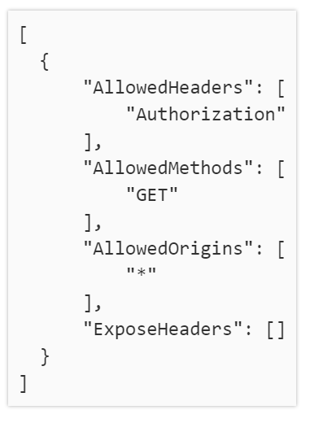
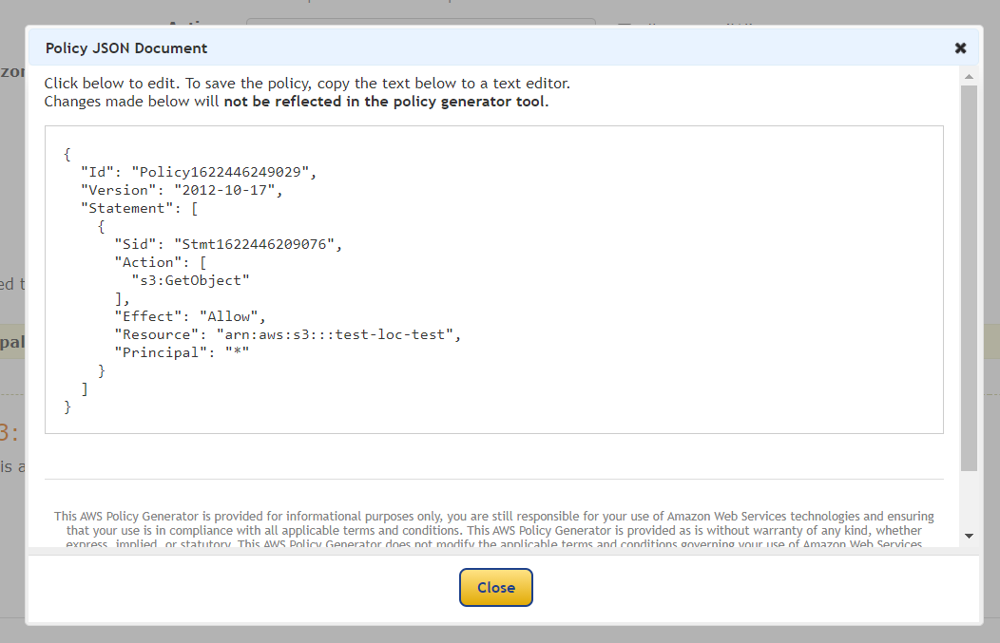
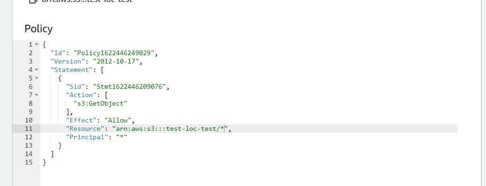
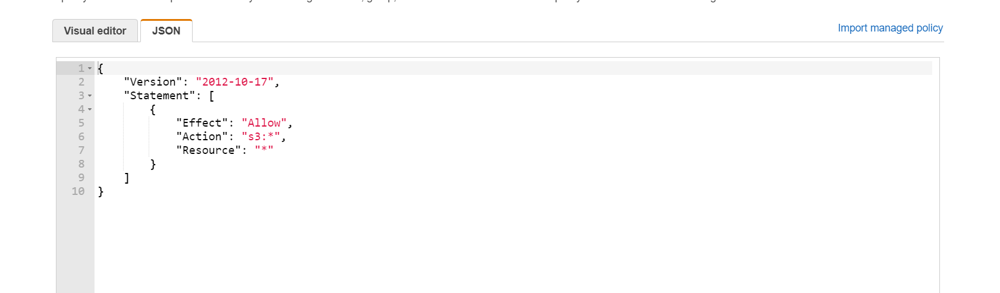
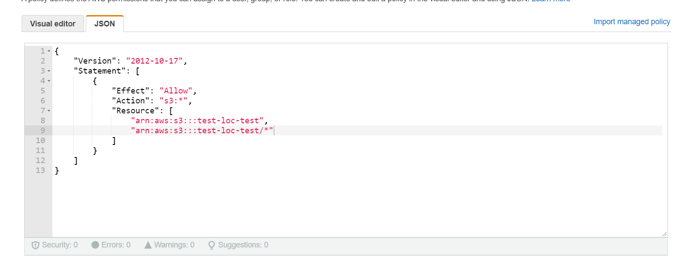
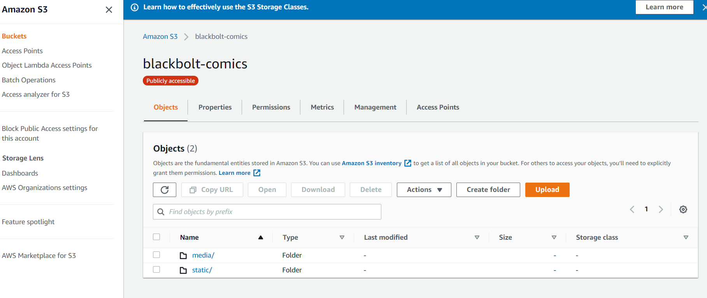
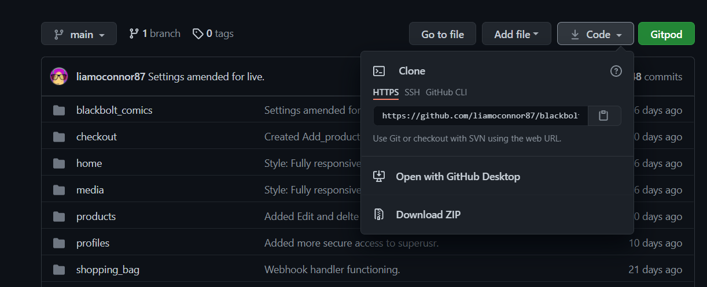

Blackbolt Comics - Online Store App - Project
==========================

**Website** - [Blackbolt Comics](https://blackbolt-comics.herokuapp.com/)

The Online Comic Book Store app is an ecommerce website providing the store to reach a wider customer base and attract more comic book fans to buy their comic books online.
Users are able to search for specific comic books and related accessories or sort for easier viewing.
Users are also able to create an account to make future visits quicker and purchasing comics easier by saving their delivery details.

UX
====
Upon accessing the Online Comic Book App, the user will be able search for a comic book they are looking for as well as Sign in or Create an Account. 

The homepage consists of a navigation bar with Search, User and Shopping basket Icons.  Below these are sub menu options of Products, Comic Books and Accessories, each othese then has it's own sub menu. 
At the top of the page to the left is the 'Blackbolt Comics' Logo.
The main Home Page displayed comic book images in the background with promotional messages in the foreground.
At the bottom of the page are the Online Comic Book Store's Contact Details and Social Media links.	

If the User would like to Search for a comic book, all they need to do is click on the Search Tool icon at the top of the Home Page, this then prompts a search box to drop down from the sub menu at the bottom of the navigation bar. The User can the enter text to search in the box and click enter. The app will then redirect the User to the Products page with the relvant search results.

The User will then have the option to 'Sort' the search results by;

- Price (low to high)
- Price (high to low)
- Name (A-Z)
- Name (Z-A)
- Category (A-Z)
- Category (Z-A)

Each Product is displayed with an Image, beneath that is the comic book publisher, name of the comic, issue number and price.

The User is able to click on a product to view more details. Once User clicks on a product the app will redirect you to a Details page where they can view; the comic book writer, the comic book artist and a description of the comic.

Users are also able to adjust the quantity of the product to purchase, add the product to their bag or return to the Products page by clicking the 'Keep Shopping' button.

The User can also Log In or Register by clicking on the User icon on the navigation bar. 

Once the User has Logged In or Registered, the navigation bar changes so the User can either view their profile page or log out. 

When the User is on their Profile page they can view their order history and update Default Delivery Information.

If the User has an item in their Shopping Bag the icon will change colour, from black to blue.

The User can click on the shopping back to view the item(s) they have in their bag from a drop down box, which also displays;

- Total price (exc. delivery)
- How much they need to spend to qualify for free delivery
- A link to 'Go To Secure Checkout'

When User clicks on the 'Go To Secure Checkout' button, they are redirected to the 'Shopping Bag' page to review their order, update the quantity of any items or remove items from their bag.

Once the User has made any changes they can click 'Go To Secure Checkout', they will then be redirected to the 'Checkout' page. Then the User will need to review the Delivery Details Form, enter their Card Details and Click 'Complete Order'. If the User changes their mind or realises they need to change an item in their order they can click 'Adjust Bag' to return to the 'Shopping Bag' page.

When the User clicks 'Complete Order' they will be redirected to a page confirming the purchase was sucessful with all order information displayed. At the bottom of the page is a button to 'Return Home' which will redirect the User back to the Home Page.

 
User Stories
----------------
Is on a seperate document - [user_stories.md](user_stories.md)

Wireframe
--------------
I used Adobe Photoshop to create wireframes in desktop, tablet and phone view.
[Link](mock_ups)

Features
======

**Existing Features**
----------------------
Navigation Bar
------------
The Navigation bar is fixed at the top of the page so that it's accessible at all times whilst the user is using the app. The Navigation links are; Search, User, Shopping Bag and the Logo which directs you to the index page. The User sub menu consists of links to the log in page and register page, but if a user is logged in, it changes to a link for the users profile and to log out of the web app. 

At the bottom of the Navigation bar is a secondary navigation bar consisting of Products, Comic Books and Accessories categories. These each have there own sub menus.

Footer
----------
Displayed at the bottom of all pages is the Online Comic Book Store's Contact details and social media links.

Home Page
----------
On the centre of the page are comic book images and promtional messages. 

Products Page
----
When the User searches for comics or accessories the User is redirected to the 'Products' page. Products are displayed with an image, publisher, comic book name, issue number and price.
User can Sort items by the following categories;

- Price (low to high)
- Price (high to low)
- Name (A-Z)
- Name (Z-A)
- Category (A-Z)
- Category (A-Z)

Product Detail Page
------------
The Product Detail page has more information about the product the User has clicked on.
User is able to adjust the Quantity of the product, Add to Bag or return to the Products page.

Admin Users are able to Edit and Delete items from this page, when clicked app redirects you to the 'Product Management page to complete the edit of the product.

Log in Page
----
The Login page consists of a form for Users to complete in order to Login to the Online Comic Book Store so they can acccess their User Profile.
The Log in form consists of 2 parts; Username/Email and Password. 

At the top of the form there is a link for the registration page. 

Register Page
------
The Register page consists of a form for Users to complete in order to Register to the Online Comic Book Store so they can create a  User Profile. The Registration form consists of 5 parts; 

- Email address
- Email address (again)
- Username
- Password
- Password (again)

At the top of the form there is a link for the Log In page.

Profile Page
-----
The Profile page consists of a Default Delivery Information form and the Users Order History.
The Default Delivery Information form is will have the Users information automatically filled if it has been saved. Users can update the information on the form from here.

Users will also be able to access any previous Order Histories to see their past purchases.

Shopping Bag Page
------------
The Shopping Bag page displays the items the USer has in their Shopping Bag ready for purchase.
User is able to Update the Quantity or remove items from the Shopping Bag here, they can also view the Sub Total and continue to the Secure Checkout page.

Checkout Page
------------
The Checkout page displays a form which the User needs to complete. Also displayed is a preview list of what the User is purchasing.

The User is able to complete the purchase as a Guest User but also as a Registered User, with the option to save their delivery information.

User is able to return to the previous page by clicking 'Adjust Bag' button from here.

Checkout Success Page
------------
Checkout Success page appears after User has completed their purchase. The Page displays a brief summary of the User's order and generates a confirmation email sent to the Users email address.

Product Management Page
------------
Admin Users have access to the 'Product Management' page.
The Page consists of a form where the Admin User is able to add products.

Message Notifications
------------
Messages are shown on the top right hand side of the page when any significant action has been carried out by the user. 

Messages could appear for the User when;

- Adding items to the Shopping Bag
- Updating the Quantity of an item
- Removing an item from the Shopping Bag
- Logging in
- Registering an Account
- Logging out
- Viewing a previous order 

Other messages appear when inputting invalid information into the apps forms, beneath input boxes.

Automated E-Mails
------------
Auto-generatred emails are sent out for resetting, confirming and verifying information. For example;

- Purchase order confirmation 
- Account verification 
- Password reset 

Style and Theme
------------
The design of the app primarily uses a consistent colour theme of black, white and blue, with white sometimes being opaque to create separation from other features on the page. Red is used as a warning sign in message notifications.

The app's layout is similar to most widely used ecommerce websites, which should be familiar for Users.

Drop shadows on the forms and product displays are all consistently implemented to give the look a more dynamic pop off the page feel. 

The app is designed to be simple, with many features self explanatory making it intuitive and easy to use for the User.

All is information on the pages is presented clearly with a comic book theme to be easy on the eyes. 

Features To Be Implemented
---------------------------------------
- Google Map API for the address in the Footer for Comic Book Store location.
- Comic book subscription service.

Technologies Used
=============

[HTML](https://html.com) - The project uses HTML to create the pages of the app.

[CSS](https://www.w3.org/Style/CSS) - The project used CSS to style the app.

[JavaScript](https://www.javascript.com) - The project used JavaScript to apply animation to the app.

[Python](https://www.python.org) - The project used Python to run the app. 

[Google Fonts](https://fonts.google.com) - The project used this for a font on the app.

[jQuery](https://jquery.com) - The project used this library to manipulate and animate the site. 

[Git](https://git-scm.com) - The project uses Git to push the project on to the Github repository.

[GitHub](https://github.com) - The project uses GitHub repository to store the app.

[Heroku](https://www.heroku.com) - This project uses Heroku to host the app. 

[Gitpod](https://gitpod.io) - The project uses Gitpod IDE to facilitate building the app.

[Validator](https://validator.w3.org) - The project used this website to validate the HTML for the app.

[Jigsaw](https://jigsaw.w3.org/css-validator/) - The project used this website to validate the CSS for the app.

[JShint](https://jshint.com) - The project used this website to validate the JS for the app. 

[PEP8 Online](http://pep8online.com) - The project used this website to validate the Python for the app.

[Adobe Photoshop](https://www.adobe.com/uk/products/photoshop.html) - The project used this software to design the layouts and logo for the app.

[Amazon AWS](https://aws.amazon.com) - The project used this to host media and static files for the app.

[Django](https://www.djangoproject.com) - The project used this web framework to help build the app.

[Fontawesome](https://fontawesome.com) - The project used this for icons in the app.

[PostgreSQL](https://www.postgresql.org) - The project used this database provided by Heroku on deployment.

[Stripe](https://stripe.com/en-gb) - The project uses this service to make and recieve payments.

Testing
======

Is on a seperate document - [testing.md](testing.md)

Deployment
==========
**Create AWS S3 file host**
-------------
Amason Web Services S3 was used to host the app's Media and Static files. 

>1. Go to the AWS website and log in/signup.
>2. Go to AWS Service tab and locate the S3 link.
>3. Click the Create Bucket button. Uncheck 'Block All Public Access' and click the check box that the 'bucket will be public'.
>4. Click the Create Bucket button.
>5. Click on the Bucket thats been created. 
>6. Go to the Properties tab and Enable Static Website Hosting, this is so we can use the Bucket to host the website.
>7. Fill in default values of index.html and error.html and click the 'Save Changes' button.
>8. Go to the CORS configuration, in the Permissions tab and enter the following CORS configuration and click the 'Save Changes' button.
 
>9. Got to the Bucket Policy, in the Permissions tab and and click the 'Policy Generator' button so you can create a policy for the bucket. 
>10. Policy settings youll need to set will be the following.

- Select Type of Policy is set to **S3 Bucket Policy**.
- Principle is set to *.
- Actions is set to **GetObject**.
- The Amazon Resource Name (ARN) can be obtained from the Bucket ARN on the Bucket Policy tab. Example - **arn:aws:s3:::test-loc-test**

>11. Once these settings are set click the 'Add Statement' button.
>12. Click the 'Generate Policy' button. This will generate a policy.
 
>13. Copy this policy and and paste it into the Bucket Policy Editor.
>14. Add '/*' to the end of the ARN to allow access to all resources in this bucket.
  
>15. Click the 'Save Changes' button. 
>16. Open the Access Control List (ACL), in the permissions tab and click on the check box for 'List' - 'Objects' in the **Everyone (public access)** section.
>17. Check the box '**I understand the effects these changes on my objects and buckets**'.
>18. Click the 'Save Changes' button.
>19. Go to AWS Service tab and locate the IAM link.
>20. Under the 'Access Management' menu select **User Groups**.
>21. Create a new group by clicking the 'Create Group' button.
>22. Give the Group a Name and click the 'Create Group' button again.
>23. Under the 'Access Management' menu select **Policies**. 
>24. Click **Create Policy**.
>25. Go to the **JSON** tab and select the link 'Import managed policy'
>26. Search for the policy '**AmazonS3FullAccess**', select and click the 'Import' button. This should import th policy.
  
>27. Copy and paste your Bucket ARN from the S3 bucket policy into 'Resource' as a list. We also want duplicate the ARN and add '/*' so all files can be accessed.

>28. Click the 'Next Tag' button. 
>29. Click the 'Next: Review" button. 
>30. Give the Policy a name and desciption.
>31. Click the 'Create Policy' button.
>32. Under the 'Access Management' menu select **User Groups** and select the group you created.
>33. Go to the Permissions tab and under the **Add Permissions** tab select '**Attach Policies**'.
>34. Select the Policy we just created and click the 'Add Permissions' button. 
>35. We now need to create a User. Under the 'Access Management' menu select **Users** and click the 'Add User' button. 
>36. Create a User with **Progammatic access** and click the 'Next: Permissions' button. 
>37. Select the Group you just created and click the 'Next: Tags' button. 
>38. Then click the 'Next: Review' button. 
>39. Then click the 'Create User' button. 
>40. Download the **.csv** file. This contains the user we just created access key and secret access key. **PLEASE SAVE THIS FILE**
>41. You will now need to connect django and install **django-storages** and **boto3** in the terminal window and add 'storages' to install apps.
>43. You will need to set your environemtal variables from the **.csv** file and will be used with Heroku. 
- AWS_ACCESS_KEY_ID - **Access Key - .csv**
- AWS_SECRET_ACCESS_KEY - **Secret Access Key - .csv**
- USE_AWS
>44. To upload our static files will also use the custom_storage file to push to the S3 bucket. 
>45. Any media files for the site, can be uploaded via the S3 link on AWS.

Heroku was used to deploy this app, in order to do this you will need to take the following steps;

**Create Heroku App**
------------
>1. Go to the Heroku website log in/sign up.
>2. Go to your app dashboard and click the "Create new app" button.
>3. Choose a unique app-name and choose a region, ideally closest to your location.
>4. To install Heroku, go to your command line and enter **npm install -g heroku**.
>5. You will now need to Log In to Heroku from the command line,  enter **heroku login -i** 
>6. Follow the instructions prompted by entering your username and password, your app should now be deployed to Heroku.

**Connect Git Remote**
--------------
You will now need to connect to your repository.
>7. Retrieve the **Heroku GIT URL** from the **Settings** tab on your Heroku Dashboard.
>8. Go to your command line and enter **git remote add heroku https://git.heroku.com/blackboltcomics.git**

**Add requirements.txt File**
--------------
>9. In the command line enter **pip3 freeze --local > requirements.txt** 

**Add Procfile**
---------
>10. In the command line enter **echo web: python run.py > Procfile**

Creating both **requirements.txt** and **Procfile** you should now be able to successfully push the repository to Heroku successfully. 
>11. in the Command line enter **git push -u heroku master**

**App Configuration**
----------
>12. Configurations needed in your setings.py or env.py files will need to be added in the **Config Vars** section located in the **Settings** tab on your dashboard.
For this app -

- AWS_ACCESS_KEY_ID
- AWS_SECRET_ACCESS_KEY
- DATABASE_URL
- EMAIL_HOST_PASS
- EMAIL_HOST_USER
- SECRET_KEY
- STRIPE_PUBLIC_KEY
- STRIPE_SECRET_KEY
- STRIPE_WH_SECRET
- USE_AWS

>13. You should now be able to view and use the Blackbolt Comic app - https://blackbolt-comics.herokuapp.com/ **HAZAR!** 

Running Code Locally
----------------------------
>1. Go to GitHub Repository. - https://github.com/liamoconnor87/blackboltcomics.git
>2. Click on the **Clone or Download** button and copy the URL link to the repository in the address box - https://github.com/liamoconnor87/blackboltcomics.git
>
>3. Head into your terminal and **cd** to the path where you would like to clone the repository.
>4. Type - **git clone https://github.com/liamoconnor87/blackboltcomics.git**. This should download your repository to your designated folder.
>5. Once this is downloaded, you can run the files through your browser to check it works.

Credits
======

Content
-----------
- The apps functionality came from the [Code Institute - Boutique Ado Module] on (https://codeinstitute.net)

Media
--------
- The logo for this website was created by the Developer.
- The background image for this website was obtained from [Insider Monkey] on (https://www.insidermonkey.com/blog/best-selling-comic-books-of-all-time-339592/)
- The Superman image from the front page was obtained from [DC Fandom] on (https://dc.fandom.com/wiki/Superman)
- The Inhuman image from the front page was obtained from [Comics Beat] on (https://www.comicsbeat.com/the-marvel-rundown-is-the-uncanny-inhumans-worth-your-dollars/)
- The Wolverine vs Hulk image from the front page was obtained from [View Comics] on (https://viewcomics.me/marvel-70th-anniversary-poster-book/issue-Full/full)
- The product images for this site were obtained from [eBay] on (hppts://www.ebay.co.uk)

Acknowledgments
--------------------------
- I took design inspiration from Ebay and the Boutique Ado tutorial.
- I received mentorship on this project from Antonio Rodriguez.
- All the Tutors that helped me at Code Institute.
- Stacey 'The Ox' Chamberlain. 