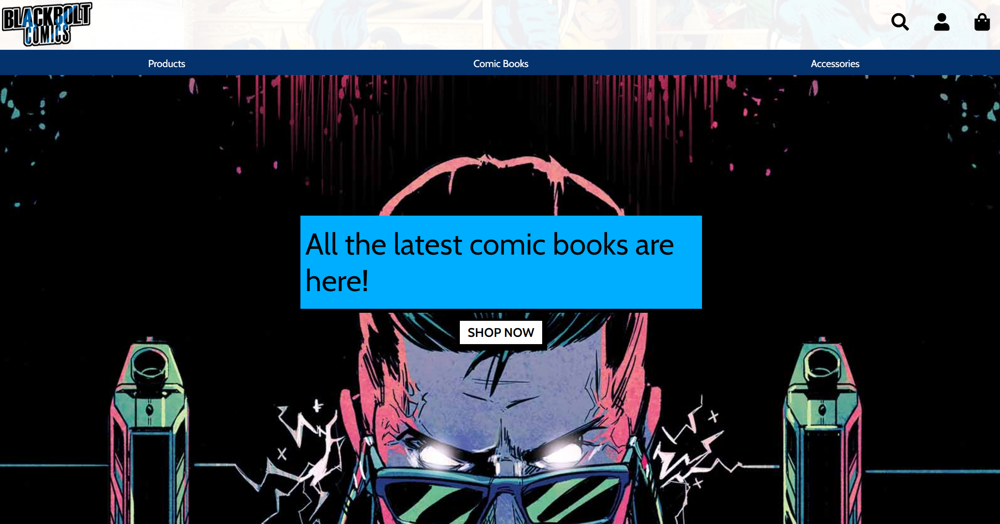

Blackbolt Comics - Online Store App - Project
==========================

**Website** - [Blackbolt Comics](https://blackbolt-comics.herokuapp.com/)

UX
====

 

User Stories
----------------
Is on a seperate document - [user_stories.md](user_stories.md)

Wireframe
--------------
I used Adobe Photoshop to create wireframes in desktop, tablet and phone view.
[Link](mock_ups)

Features
======

**Existing Features**
----------------------
Navigation Bar
------------

Index Page
----------

Results Page
----
 

Log in Page
----

Register Page
------

Profile Page
-----

Update Information Page
-----

Search Tool
--------

Business Cards
------

Admin Page
------------

Flash Message
--------

Style and Theme
---------

**Features To Be Implemented**
---------------------------------------
- Google Map API for the address of each business
- Static Profile Page for each business a user can observe. 

Technologies Used
=============

[HTML](https://html.com) - The project uses HTML to create the pages of the app.

[CSS](https://www.w3.org/Style/CSS) - The project used CSS to style the app.

[JavaScript](https://www.javascript.com) - The project used JavaScript to apply animation to the app.

[Python](https://www.python.org) - The project used Python to run the app. 

[Google Fonts](https://fonts.google.com) - The project used this for a font on the app.

[jQuery](https://jquery.com) - The project used this library to manipulate and animate the site. 

[Git](https://git-scm.com) - The project uses Git to push the project on to the Github repository.

[GitHub](https://github.com) - The project uses GitHub repository to store the app.

[Heroku](https://www.heroku.com) - This project uses Heroku to host the app. 

[Gitpod](https://gitpod.io) - The project uses Gitpod IDE to facilitate building the app.

[Validator](https://validator.w3.org) - The project used this website to validate the HTML for the app.

[Jigsaw](https://jigsaw.w3.org/css-validator/) - The project used this website to validate the CSS for the app.

[JShint](https://jshint.com) - The project used this website to validate the JS for the app. 

[PEP8 Online](http://pep8online.com) - The project used this website to validate the Python for the app.

[Adobe Photoshop](https://www.adobe.com/uk/products/photoshop.html) - The project used this software to design the layouts and logo for the app.

[Amazon AWS](https://aws.amazon.com) - The project used this to host media and static files for the app.

[Django](https://www.djangoproject.com) - The project used this web framework to help build the app.

[Fontawesome](https://fontawesome.com) - The project used this for icons in the app.

Testing
======

Is on a seperate document - [testing.md](testing.md)

Deployment
==========

Heroku was used to deploy this app, in order to do this you will need to take the following steps;

**Create Heroku App**
------------
>1. Go to the Heroku website log in/sign up.
>2. Go to your app dashboard and click the "Create new app" button.
>3. Choose a unique app-name and choose a region, ideally closest to your location.
>4. To install Heroku, go to your command line and enter **npm install -g heroku**.
>5. You will now need to Log In to Heroku from the command line,  enter **heroku login -i** 
>6. Follow the instructions prompted by entering your username and password, your app should now be deployed to Heroku.

**Connect Git Remote**
--------------
You will now need to connect to your repository.
>7. Retrieve the **Heroku GIT URL** from the **Settings** tab on your Heroku Dashboard.
>8. Go to your command line and enter **git remote add heroku https://git.heroku.com/blackboltcomics.git**

**Add requirements.txt File**
--------------
>9. In the command line enter **pip3 freeze --local > requirements.txt** 

**Add Procfile**
---------
>10. In the command line enter **echo web: python run.py > Procfile**

Creating both **requirements.txt** and **Procfile** you should now be able to successfully push the repository to Heroku successfully. 
>11. in the Command line enter **git push -u heroku master**

**App Configuration**
----------
>12. Configurations needed in your setings.py or env.py files will need to be added in the **Config Vars** section located in the **Settings** tab on your dashboard.
For this app -

- AWS_ACCESS_KEY_ID
- AWS_SECRET_ACCESS_KEY
- DATABASE_URL
- EMAIL_HOST_PASS
- EMAIL_HOST_USER
- SECRET_KEY
- STRIPE_PUBLIC_KEY
- STRIPE_SECRET_KEY
- STRIPE_WH_SECRET
- USE_AWS

>13. You should now be able to view and use the Blackbolt Comic app - https://blackbolt-comics.herokuapp.com/ **HAZAR!** 

Running Code Locally
----------------------------
>1. Go to GitHub Repository. - https://github.com/liamoconnor87/blackboltcomics.git
>2. Click on the **Clone or Download** button and copy the URL link to the repository in the address box - https://github.com/liamoconnor87/blackboltcomics.git
>
>3. Head into your terminal and **cd** to the path where you would like to clone the repository.
>4. Type - **git clone https://github.com/liamoconnor87/blackboltcomics.git**. This should download your repository to your designated folder.
>5. Once this is downloaded, you can run the files through your browser to check it works.

Credits
======

Content
-----------
- The apps functionality came from the [Code Institute - Boutique Ado Module] on (https://codeinstitute.net)

Media
--------
- The logo for this website was created by the Developer.
- The background image for this website was obtained from [Insider Monkey] on (https://www.insidermonkey.com/blog/best-selling-comic-books-of-all-time-339592/)
- The Superman image from the front page was obtained from [DC Fandom] on (https://dc.fandom.com/wiki/Superman)
- The Inhuman image from the front page was obtained from [Comics Beat] on (https://www.comicsbeat.com/the-marvel-rundown-is-the-uncanny-inhumans-worth-your-dollars/)
- The Wolverine vs Hulk image from the front page was obtained from [View Comics] on (https://viewcomics.me/marvel-70th-anniversary-poster-book/issue-Full/full)
- The product images for this site were obtained from [eBay] on (hppts://www.ebay.co.uk)

Acknowledgments
--------------------------
- I took design inspiration from Ebay and the Boutique Ado tutorial.
- I received mentorship on this project from Antonio Rodriguez.