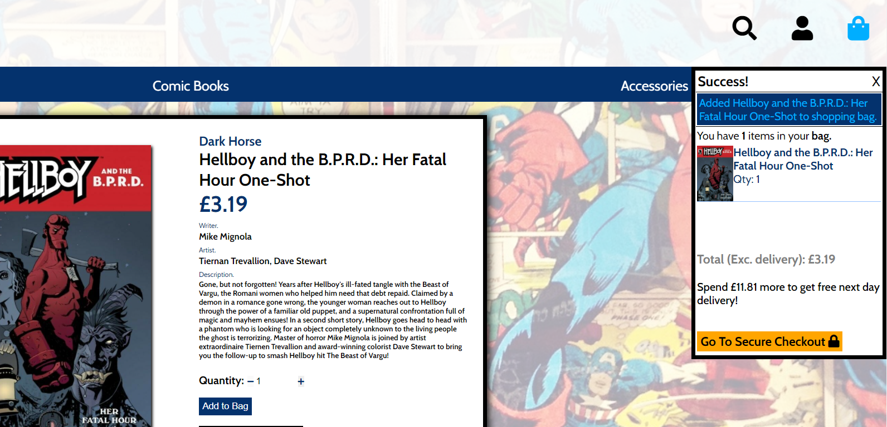
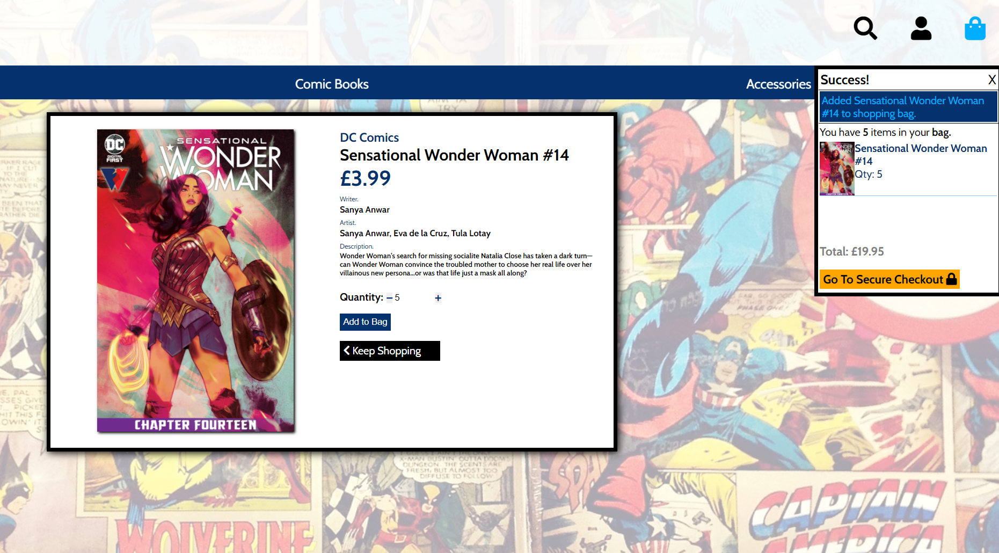
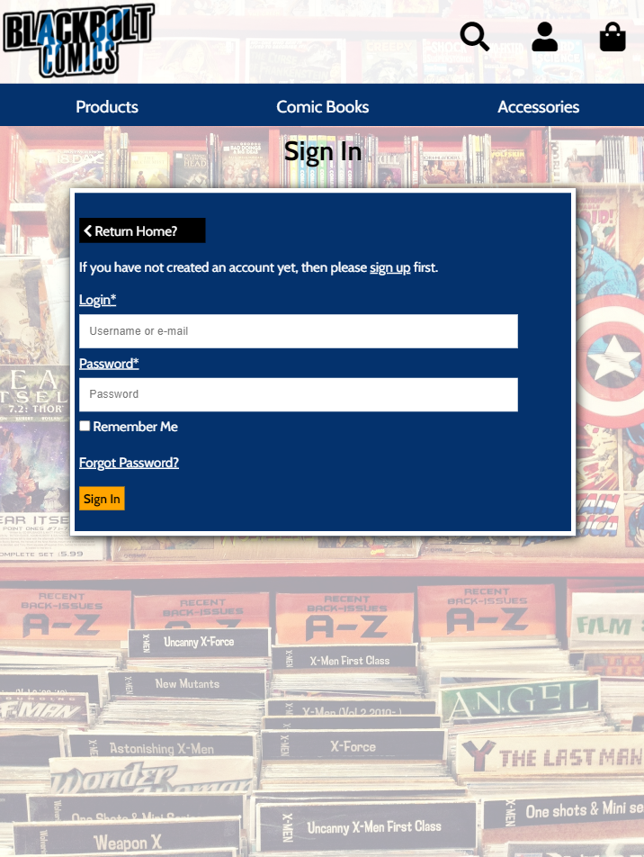

Testing
======

**User Story Testing**
-------

*As a User, I would like a Navigation Bar, so I can navigate the App.*
-------
- When a User visits the page and starts using the app, the navigation bar is positioned at the top of every page.

Steps taken;
>Go to the Blackbolt Comics app website - https://blackbolt-comics.herokuapp.com

>Observe that the navigation bar is at the top of the page.

>Navigate the site to make sure the navigation bar is displayed on all pages.

*As a User, I would like the Navigation Bar to take me to the Register page.*
-------
- When User clicks on the User icon a sub menu appears with the Register link.
- When the User clicks on the Register link the User should be redirected to the Register page.

This testing also applies to these User stories;

***As a User, I would like the Navigation Bar to take me to the Log In page.***

***As a User, I would like the BlackBolt Comics logo to take me to the Index page.***

Steps Taken;
>Click on the User Icon. 

>Click on the Register link on the Navigation bar's sub menu.

>Repeat for the Login link.

>Click on the Blacbolt Comics logo.

>Observe that each link redirects me to the relevant page.

*As a User, I would like the Shopping bag icon to indicate I have an item in my bag when an item is added.* 
-------
- When an item is added to the Shopping bag the Shopping bag icon on the Navigation bar changes colour.
- A notification message appears underneath the Shopping bag when the item is added.
- The User is able to view a mini preview from this message notification or when they click on the Shopping bag icon.
- The message also provides a link to the Checkout/Shopping bag page.

This testing also applies to these User stories;

***As a User, when I click on the shopping bag icon I would like it to display what is in my bag.*** 

***As a User, when I have products in my Shopping bag I would like a link to take me to the Secure Checkout/Shopping bag page.***

Steps taken;
>Naigate to the 'all products' page.

>Select a product.

>On the products detail page add product to Shopping bag.

>Observe the Shopping bag icon changes in appearance.

>Observe a notification message of 'success'.

>Observe Shopping bag preview of item in notification message.

>Observe link to secure checkout/Shopping bag.

>Close notification message.

>Click on Shopping bag icon.

>Observe notification message reappears with the relevant information.

*As a User, I would like the Navigation Bar to have links to different product categories and takes me to them.*
-------
- Underneath the main navigation bar is a secondary bar consisting of 3 categories; Products, Comic Books and Accessories.
- Each category when selected opens a sub menu with more specific options.
- Each sub option will take you to the relevant product page.

Steps taken;
>Click on the Product link on the secondary navigation bar.

>Observe the sub menu appear.

>Click the 'Comic Books' link.

>Observe the link load into the 'Products' page with only comic books listed.

>Repeat for each link in this sub menu.

>Repeat the process for the 'Comic Books' link on the secondary navigation bar.

>Repeat the process for the 'Accessories' link on the secondary navigation bar.

*As a User, on the navigation bar I would like a Search Tool, so I can search the database for a specific product I'm interested in.*
-------
- When a User clicks the 'Search Tool' icon on the navigation bar the search box appears.
- The User is then able to type what they are searching for into the box and press enter to execute the search.
- User is then redirected to the 'Products' page with the search results.

This testing also applies to these User stories;

***As a User, once I have clicked search, I would like the relevant products to be displayed for me to view on the page.***

Steps taken;
>Click on the 'Search Tool' icon on the navigation bar.

>Observe the search box appear.

>Enter search criteria and press enter.

>Observe app redirecting you to the 'Products' page and list search results.

*As a User, I would like the websites contact information so I am able to contact them directly.*
-------
- At the bottom of every page is the website footer.
- The footer consists on contact information and social media links.
- Each social media link redirects you to the website's social media page.
- When clicking on the 'Contact number' link the smart device will open the phone app.
- When clicking on the 'Email address' link the smart device will open the email app.

This testing also applies to these User stories;

***As a User, I would like to be able to see which social media platforms the website is on.***
***As a User, I would like a link to Facebook so I can visit the websites Facebook page.***
***As a User, I would like a link to Twitter so I can visit the websites Twitter page.***
***As a User, I would like a link to Instagram so I can visit the websites Instagram page.***

Steps taken; 
>Navigate to the bottom of the page to view 'Footer'.

>Observe contact information is there.

>Observe social media links are there.

>Click on the 'phone number'.

>Observe redirection to phone app on smart device.

>Repeat process for 'Email Address'.

>Click on 'Facebook' link.

>Observe redirection to Facebook page.

>Repeat process for 'Twitter' link.

>Repeat process for 'Instagram' link.

*As a User, I would like to Register on to the site.*
-------
- Users are able to register on the website and save their infomation.
- Users are able to store their delivery details, so they don't need to re-enter each time they purchase items from the website.
- Users will need to supply an email address, a username and password to register.
- Each User's details needs to be unique for the database and cannot match other existing User's details.
- The form will prompt you if details are already taken.
- The form has a 'Return Home' button incase User wants to return to the Home Page.
- The form has a link to the 'Sign In' page, incase the User has navigated to the wrong page and is already registered.
- Upon completing the form the User can click 'Sign Up' button to complete registration.
- A message notification appears if registration is successful and redirects you to the Home Page.

This testing also applies to these User stories;

***As a User, I would like a convenient link at the bottom of the Register page, that takes me to the Log In page, in case I have mistakenly clicked the wrong link.***
***As a User, when I am registering I would like a message to show if a username already exists on the database.*** 
***As a User, when I am registering I would like a message to show if the passwords don't match when I verify.***
***As a User, when I am registering I would like a message to show if an email already exists on the database.***
***As a User, when I am registering I would like a message to show if the emails don't match when I verify.*** 
***As a User, I would like a message that tells me I have successfully registered.***
***As a User, I would like an email confirmation to say that I have registered.***
***As a User, I would like to be able to activate my profile using an email confirmation.***

Steps taken;
>Navigate to the registration page.

>Click the 'Return Home' link.

>Observe redirection to 'Home' Page.

>Click the 'Sign In' link.

>Observe redirection to 'Log In' page.

>After entering an email address, if email already exists observe prompt message from form that you must use a different email address.

>After reentering your email address, if email addresses do not match observe prompt message from form that the email addresses do not match.

>After entering a username, if username already exists observe prompt message from form that you must use a different username.

>After reentering your chosen password, if password doesn't match observe prompt message from form that the passwords do not match.

>Complete registration form by clicking 'Sign Up' button.

>Observe redirection to 'Verify Your E-mail Address' Page.

>Observe email sent to User's inbox.

>Click link in email to verify email address.

>Observe redirection to 'Confirm E-mail Address' page.

>Click 'Confirm' button.

>Observe redirection to 'Sign In' page.

>Observe notification message of 'Success' of email confirmation and registration completion.

*As a User, I would like to be able to Log In to my profile on the app.* 
-------
- Registered Users are able to login to the website from the 'Sign In' page.
- Users will need to enter their 'Username' or 'Email'.
- Users will need to enter their 'Password'.
- Users can also click the 'Remember Me' check box, so they remain logged in when they revisit the website.
- The form has a 'Return Home' button incase User wants to return to the Home Page.
- The form has a link to the 'Register' page, incase the User has navigated to the wrong page and is not already registered.
- Upon completing the form the User can click 'Sign In' button to complete 'Login'.
- The form will prompt the User if the 'Username/Email' or 'Password' do not match with the details held on the database.
- There is a link to a 'Password Reset' page incase the User has forgotton their password. 
- A message notification appears when User has successfully logged in.
- User will then be able to navigate to their profile page.

This testing also applies to these User stories;

***As a User, I would like a convenient link at the bottom of the Log In page that takes me to the Register page, in case I have mistakenly clicked the wrong link.***
***As a User, when I am logging in, I would like a message to show if the username or password doesn't match on the database.***
***As a User, I would like a message to show I have successfully Logged In.***
***As a User, I would like to be able to reset my password incase I forget it.***

Steps taken;
>Navigate to the 'Login' page.

>Click the 'Return Home' link.

>Observe redirection to 'Home' Page.

>Click the 'Sign Up' link.

>Observe redirection to 'Registration' page.

>Incorrectly input Username/Email address or Password.

>Observe form prompt message informing you of incorrect input.

>Click 'Forgot Password' link.

>Observe redirection to 'Password Reset' page.

>Enter User's email address.

>Click 'Reset My Password'.

>Retrieve password reset email.

>Click link to reset password.

>Observe redirection to 'Password Reset' page on the website.

>Enter new password twice correctly, otherwise form prompt for password to match.

>Click 'Reset Password'.

>Observe redirection to 'Sign In' page.

>Observe message notification of successful password reset.

>Click 'Remember Me' check box and click 'Sign In' button.

>Observe redirection to 'Home Page'.

>Observe message notification that login was successful.

>To observe check box is working correctly, leave site and revisit to confirm User is still logged into website.

*As a User, once I am registered I would like a Profile page specific to me.*
-------
- Profile link appears in the sub menu of the User icon on the navigation bar once the User has signed in.
- User will be able to view their previous orders.
- User will be able to enter and update delivery details and save to their profile.
- User will get a message notification when delivery details have been saved or updated.
- User will be able to log out from the sub menu of the User icon.

This testing also applies to these User stories;

***As a User, I would like the profile page to display my order history.***
***As a User, I would like to be able to click on my previous order numbers to view my order history.***
***As a User, I would like a message to alert me that this is a previous order.***
***As a User, I would like the profile page to display my default delivery information.***
***As a User, I would like the profile page to update my default delivery information.***
***As a User, I would like the Navigation Bar to allow me to log out of my Profile on the App.***
***As a User, I would like a message that tells me I have successfully been logged out.***
***As a User, I would like a message that tells me I have successfully updated my information.***

Steps taken;

>Navigate to the 'Profile' page using the User icon on the navigation bar. 

>Observe redirection to 'Profile' page.

>Observe order history displayed.

>Click on 'Order Number'.

>Observe redirection to 'Order History' page.

>Observe 'Order History' information.

>Observe message notification that 'this is a past confirmation order number'.

>Click 'Return to Profile' button to return to User profile.

>Observe redirection to 'Profile' page.

>Observe delivery information form displayed.

>Input delivery information onto the form.

>Click the 'Updated Information' button.

>Observe notification message 'Success' updated profile.

>Navigate to the 'Log out' link using the User icon on the navigation bar.

>Observe redirection to 'Sign Out' page.

>Click 'Sign Out' button.

>Observe redirection to Home Page.

>Observe notification message that 'Sign Out' was successful.

*As a User, I would like to be able to view the products for sale on a products page.*
-------
- Users will be able to browse all products on the website via the 'Products' page.
- Users will be able to 'Sort' the products by; price, name and category in assending and dessending order.
- Users will be able to see the number of products displayed on the 'Products' page, at the top left of the page.
- Each product will have a name and price displayed beneath an image of the product.
- Users will be able to click on each product to view more information about the product.

This testing also applies to these User stories;

***As a User, I would like to be able to sort products by price, name or category.***
***As a User, I would like to be able to click on a product to view more detailed information about the product.***
***As a User, I would like to be able to clearly see the price of each product on the products page.***
***As a User, I would like the products page to display how many products are on the products page.***
***As a User, I would like the products page to have a link to show all products on the products page.***

Steps taken;

>Navigate to 'Products' page.

>Observe products are displayed on the page.

>Observe name and price are clearly displayed under image of each product.

>Observe count of how many products are displayed on 'Products' page.

>Sort products by 'Price (low to high)'.

>Observe order changes to products by 'Price (low to hight)'.

>Repeat process for 'Price (high to low)'.

>Repeat process for 'Name (A-Z)'.

>Repeat process for 'Name (Z-A)'.

>Repeat process for 'Category (A-Z)'.

>Repeat process for 'Category (Z-A)'.

>Click on a product.

>Observe redirection to relevant 'Products Detail' page.

>Return back to 'Products' page.

>Click 'Products Home' link.

>Observe redirection to default product page.

*As a User, on the products detail page I would like a 'quantity' tool so I can choose to buy more than one of the same product.* 
-------
- Users on the 'Products' page will be able to select how many of that item they want to add to their 'Shopping Bag' for purchase.
- Users will be able to add to their 'Shopping Bag' by using the 'Add to Bag' button.
- Users will be able to return back to the 'Products' page using the 'Keep Shopping' button.
- User will see a message notification of items successfully being added to 'Shopping Bag'.

This testing also applies to these User stories;

***As a User, on the products detail page I would like an 'add to bag' button so I can add the product to my shopping bag.***
***As a User, on the products details page I would like a 'keep shopping' button so I can return to the products page.***
***As a User, when I add a product to the bag I would like a message to confirm that it was successfully added.***

Steps taken;

>Naviage to a product detail page.

>Use the plus or minus button on the 'Quantity Tool'.

>Observe the number of the item quantity change.

>Click the 'Add to Bag' buttom.

>Observe message notification of item 'Success' added to 'Shopping Bag'.

>Click the 'Keep Shopping' link.

>Observe redirection to 'Products' page.

*As a User, I would like a Shopping bag page that displays what I've added to my Shopping bag.*
 -------
- Users can access the 'Shopping Bag' page by the 'Shopping Bag' icon on the navigation bar.
- Users will be able to adjust and update the quantity of each item in the 'Shopping Bag'.
- Updating the quantity to zero will remove the item from the 'Shopping Bag'.
- Users will be able to remove items from the 'Shopping Bag'.
- A subtotal of cost for each quantity of products is displayed.
- A bag total is displayed.
- The elivery cost is displayed.
- A grand total is displayed.
- If the User hasn't reached the free delivery threshold a message notification displayed how much is needed to spend to achieve free delivery.
- User will be able to 'Secure Checkout' page to pay for items.

This testing also applies to these User stories;

***As a User, I would like an 'update' button to adjust the quantity of the products.***
***As a User, I would like a 'remove' button to remove a product from my Shopping bag.***
***As a User, I would like the subtotal of a product to reflect the quantities of each product.***
***As a User, I would like a 'Bag Total' displayed so I know the Bag Total cost.***
***As a User, I would like the 'Delivery' cost displayed so I know how much the delivery cost is.***
***As a User, I would like a 'Grand Total' displayed so I know the total cost including the 'Bag Total' and 'Delivery' combined.***
***As a User, I would like a message displaying how much I need to spend to qualify for free delivery.***
***As a User, I would like a link to a 'Secure Checkout' page so I can securely pay for my chosen products.***

Steps taken;

>Navigate to the 'Shopping bag' using the 'Shopping bag' icon on the navigation bar.

>Observe redirection to 'Shopping Bag' page.

>Observe 'Shopping Bag' items that have been added.

>Adjust the quantity of a product and click 'Update'.

>Observe message notification that product quantity has been updated.

>Observe the product quantity has been updated on the 'Shopping Bag' page.

>Observe the 'Subtotal' change due to change in quantity.

>Adjust Quantity to zero and click 'Update'.

>Observe item being removed from 'Shopping Bag'.

>Observe message notification of 'Success' item removal from 'Shopping bag'.

>Click 'Remove' button.

>Observe item has been removed from 'Shopping Bag'.

>Observe message notification of 'Success' item removal from 'Shopping Bag'.

>Observe 'Bag Total'.

>Observe 'Delivery Total'.

>Observe 'Grand Total'.

>If free delivery threshold has not been met, observe message notification of how much is needed to spend to achieve free delivery.

>Click 'Go to Secure Checkout' link.

>Observe redirection to 'Checkout' page.

*As a User, I would like the checkout page to display what I am paying for.*
-------
- User will be able to view a preview list of the products in their 'Shopping Bag'.
- User will have a form that allows them to enter their delivery information.
- User will be able to enter their card details for payment.
- Only valid card details will be accepted.
- User will be able to return to 'Shopping Bag' to adjust items in their 'Shopping Bag'.
- User can check out as a guest, log in or register an account.
- If a user is logged in they can save their delivery informatio to their 'Profile' for future purchases.
- Upon completion of the User's order, they will receive a confirmation email with their order details and will be redirected to the 'Checkout Success' page.

This testing also applies to these User stories;

***As a User, I would like a form to enter my delivery information into.***
***As a User, I would like a link to return to the previous page so I can adjust the items in my Shopping Bag.***
***As a User, I would like the option at checkout to 'Login' or 'Create an account' so I can save my delivery information.***
***As a User, I would like the option to checkout without registering to the website.***
***As a User, I would like a 'Complete Order' button to complete my purchase.***
***As a User, I would like a message to confirm my order was successful.***
***As a User, when I complete my order I would like to be taken to the 'Checkout Success' page.***
***As a User, I would like an email confirmation sent to me once my order is complete.***

Steps taken;

>Navigate to 'Secure Checkout' page through the 'Shopping Bag' page.

>Observe list of products ready for purchase.

>Click 'Adjust bag' button.

>Observe redirection to 'Shopping Bag' page and click 'Go to Secure Checkout' to return to 'Checkout' page.

>Observe delivery information form.

>User completes delivery details.

>Enter card details.

>Click 'Complete Order' button.

>Observe payment being processed.

>Observe redirection to 'Checkout' page.

>Observe message notification order was successful.

>As an existing User observe link to 'Create an Account' or 'Login'.

>User creates and account or logs in.

>Navigate back to 'Checkout' page.

>Enter delivery details.

>Click check box to save information to 'Profile'.

>Enter card details.

>Click 'Complete Order' button.

>Observe redirection to 'Check Out' page

>Observe message notification that check out was successful.

*As a User, I would like the 'Checkout Success' page to display all my order information.*
-------
- 'Checkout Sucess' page displays all order details including confirmation that an email has been sent to User email address.
- 'Return Home' button displayed so User is able to return to 'Home Page' from 'Checkout Success' page.

This testing also applies to these User stories;

***As a User, I would like a 'Return Home' button on the 'Checkout Success' page to take me back to the home page.***

Steps taken;

>Observe order information is displayed on 'Checkout Success' page.

>Click 'Return Home' button.

>Observe redirection to 'Home Page'.

*As a User, who owns the app I would like to have Admin capabilities.*
-------
- User with 'Admin' capabilities will have access to a 'Product Mamangement' page avaliable through the 'User' icon on the navigation bar sub menu.
- Admin User will be able to; 'Add', 'Edit' and 'Delete' items from the database.
-  'Edit' and 'Delete' buttons are avalible to the Admin User on all products on the 'Products' and 'Product Detail' page.

This testing also applies to these User stories;

***As an Admin User, I would like a 'Product Management' page so I can add or edit products to the app.***
***As an Admin User, I would like to be able to edit products on the app.***
***As an Admin User, I would like to be able to delete products from the app.***
***As an Admin User, I would like a 'Add Product' button when I'm adding a new product on the 'Product Management' page.***
***As an Admin User, I would like a 'Update Product' button when I'm updating a product on the 'Product Management' page.***
***As an Admin User, I would like a 'Cancel' button on the 'Product Management' page that takes me to the 'All Products' page.***

Steps taken;

>Log in as 'Admin User'.

>Observe message notification that you have successfully signed in as 'Admin User'.

>Open the 'User' icon sub menu on the navigation bar.

>Observe 'Product Management' link is displayed.

>Click 'Product Management' link.

>Observe redirection to the 'Add Products' page.

>Observe 'Add Products' form.

>Complete form to 'Add Product'.

>Click 'Add Product' button to complete adding a product to the database.

>Observe redirection to the added products 'Product Detail' page.

>Observe message notification that product has been added successfully.

>Observe 'Edit' and 'Delete' buttons are displayed on the 'Product Detail' page.

>Click 'Edit' button.

>Observe redirection to the 'Edit Product' page.

>Observe message notification confirming you are editing a product.

>Observe product form information.

>'Edit' relevant field, for example 'Price'.

>Click 'Update Product' button.

>Observe redirection to 'Product Detail' page.

>Observe message notification that product has been successfully updated.

>Observe updated information is correctly displayed on 'Product Detail' page.

>Return to 'Edit Product' page.

>Click 'Cancel' button.

>Observe redirection to the 'Products' page.

>Observe 'Edit' and 'Delete' buttons are displayed on the 'Products' page.

>Click 'Delete' button on a product.

>Observe redirection to 'Product' page.

>Observe message notification that product has been successfully deleted.

>Observe product has been deleted and is no longer displayed on the 'Products' page.

**Websites Compatibility**
---------------------------------------

The app is compatible on the following browsers - 

- Chrome
- Opera
- Vivaldi
- Safari
- Firefox
- Microsoft Edge
- Internet Explorer

**Websites responsiveness**
---------------------------------------

Website responsive layout was primarily tested on Chrome, Opera and Vivaldi using the Developer Tools. 
The website also worked well with Microsoft Edge, Internet Explorer, Safari and Firefox.
The website also works well with smart devices.

## Desktop View's ##

>**Home page**

>

>**Product page**

>

>**Product detail page**

>

>**Profile page**

>

>**Log In page**

>

>**Registration page**

>

>**Shopping Bag page**

>

>**Checkout page**

>

>**Checkout Success page**

>

>**Order History page**

>

## Ipad Pro View's ##

>**Home page**

>

>**Product page**

>

>**Product detail page**

>

>**Profile page**

>

>**Log In page**

>

>**Registration page**

>

>**Shopping Bag page**

>

>**Checkout page**

>

>**Checkout Success page**

>

>**Order History page**

>

## Ipad View's ##

>**Home page**

>

>**Product page**

>

>**Product detail page**

>

>**Profile page**

>

>**Log In page**

>

>**Registration page**

>

>**Shopping Bag page**

>

>**Checkout page**

>

>**Checkout Success page**

>

>**Order History page**

>

## Smart Phone View's ##

>**Home page**

>

>**Product page**

>

>**Product detail page**

>

>**Profile page**

>

>**Log In page**

>

>**Registration page**

>

>**Shopping Bag page**

>

>**Checkout page**

>

>**Checkout Success page**

>

>**Order History page**

>

**Bugs and Problems**

Automated checks
================

I used the W3C's Validators to check my HTML and CSS code. Here are the steps I took.

>**HTML**

>

>**CSS**

>

1. **Using the websites URL address to check the HTML code**

>1. Go to https://validator.w3.org and select the URI tab. 

>2. Enter https://blackbolt-comics.herokuapp.com into the address bar and click **Check**.

>3. Confirm that no errors show. 

>4. Do the same for each page. 

2. **Using the websites file upload tab to check the CSS code**

>1. Go to https://jigsaw.w3.org/css-validator/ and select the By file upload tab. 

>2. Upload the base.css file and click **Check**.

>3. Confirm that no errors show.

I used JShint to validate my Javascript code. Here are the steps I took. 

>**JS**

>

3. **Input directly to check JS code.**

>1. Go to the repository - https://github.com/liamoconnor87/blackboltcomics

>2. Copy the base.js file.

>3. Go to https://jshint.com.

>4. Paste the code from the base.js file in to where instructed.

>5. Validation works automatically, confirm no errors.

>6. Repeat process for all JS file.

>**Python**

>

4. **Input directly to check Python code.**

>1. Go to the repository - https://github.com/liamoconnor87/blackboltcomics

>3. Click on the **blackbolt_comics** folder link. Click on the **settings.py** file link. This should take you to settings.py page displaying the code. From here you can highlight all the code and copy it. 

>4. Once copied, go to http://pep8online.com.

>5. Paste the code from the settings.py file in to where instructed.

>6. **Click** Check code to confirm no errors.

>7. Repeat for all **.py** files.